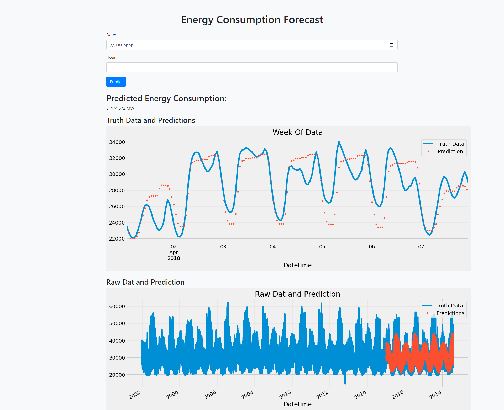

# EnergyConsumptionForecastingML
This project focuses on creating a web application for predicting energy consumption based on time series data. The application utilizes an XGBoost machine learning model trained on historical energy consumption patterns.
### *Created by Team23*

<br>

## Dataset Information:

The project uses the "PJME_hourly.csv" dataset, which contains hourly energy consumption data. The dataset includes features such as date and the energy consumption value (PJME_MW).

### Kaggle: (https://www.kaggle.com/datasets/robikscube/hourly-energy-consumption?select=PJME_hourly.csv)

<br>

## Getting Started

1. Clone the repository:

    ```bash
    git clone https://github.com/yourusername/energy-consumption-forecast
    cd energy-consumption-forecast
    ```
    
2. Run the Flask App:

    ```bash
    python app.py
    ```

The Flask app will be accessible at [http://localhost:5000](http://localhost:5000).

<br>

## Usage

1. Navigate to the web application at [http://localhost:5000](http://localhost:5000).

2. Enter a date in the provided form and click "Predict" to get the forecasted energy consumption.

3. The predicted energy consumption value will be displayed on the page.

4. Optionally, check the visualizations for truth data and predictions.

<br>

## Web App Screenshots



<br>

## Credits

- **Pandas**: Data manipulation and analysis library.
- **XGBoost**: Machine learning library for regression tasks.
- **Flask**: Web application framework for Python.
- **Bootstrap**: Front-end framework for responsive web design.

<br>

